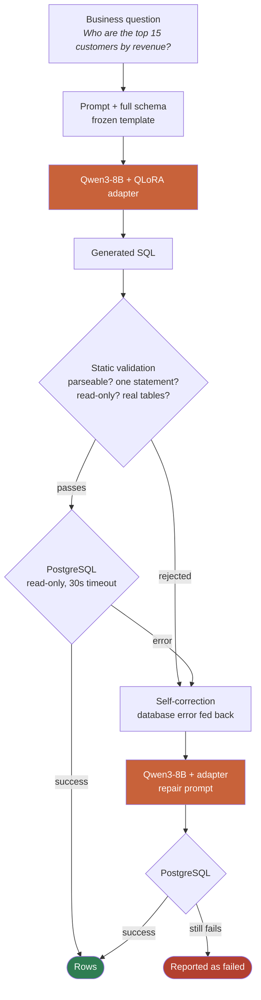

<div align="center">

# Enterprise Text-to-SQL — Fine-Tuning & Self-Correction

**Does fine-tuning actually improve text-to-SQL? I measured it instead of assuming.**

[](https://huggingface.co/hari-krishna-ai/qwen3-8b-text2sql-qlora)
[](https://huggingface.co/datasets/hari-krishna-ai/enterprise-text-to-sql-benchmark)
[](https://huggingface.co/spaces/hari-krishna-ai/enterprise-text-to-sql)
<br>


### 10.82 % → 52.10 %

strict execution accuracy on **453 held-out questions**

</div>

---

## The result

Same prompt, same schema, same database, same executor. **Only the weights changed.**

| # | configuration | strict accuracy | executable SQL | hallucination |
|---|---|---:|---:|---:|
| 1 | Base Qwen3-8B | 10.82 % | 98.90 % | 0.66 % |
| 2 | Base + schema retrieval | 9.27 % | 92.27 % | 3.31 % |
| 3 | **Fine-tuned (QLoRA)** | **50.99 %** | 95.81 % | 1.99 % |
| 4 | Fine-tuned + retrieval | 41.72 % | 94.92 % | 3.53 % |
| 5 | **Fine-tuned + self-correction** | **52.10 %** | **98.23 %** | **0.66 %** |

Trained on **one free Kaggle T4** in 4 h 53 m. 43.6 M trainable parameters — **0.917 %** of the model.

> [!IMPORTANT]
> **Most of the +40 points is the model learning column conventions, not better SQL reasoning.**
> "Right rows, wrong columns" went **159 → 0**, while genuinely wrong row sets only fell 240 → 203.
> I could only see that because the harness tracks projection-tolerant accuracy separately.
> The `hard` tier (+81.2 pp) is where reasoning genuinely improved.

---

## The pipeline



---

## Try it

<table>
<tr>
<td width="33%" align="center">

### 🔍 Explore
**[Live demo →](https://huggingface.co/spaces/hari-krishna-ai/enterprise-text-to-sql)**

All 453 predictions.
Filter to the ones fine-tuning fixed — or broke.

</td>
<td width="33%" align="center">

### 📦 Use the model
**[Model card →](https://huggingface.co/hari-krishna-ai/qwen3-8b-text2sql-qlora)**

Copy-paste loading snippet.
⚠️ needs `enable_thinking=False`

</td>
<td width="33%" align="center">

### 📊 Benchmark yours
**[Dataset →](https://huggingface.co/datasets/hari-krishna-ai/enterprise-text-to-sql-benchmark)**

```python
load_dataset(
 "hari-krishna-ai/"
 "enterprise-text-to-sql-benchmark")
```

</td>
</tr>
</table>

---

## Why the evaluation is the interesting part

<details open>
<summary><b>Correctness is judged by execution, never by string similarity</b></summary>

<br>

These are different strings and identical in meaning. Any honest benchmark must count both correct:

```sql
SELECT COUNT(*)           FROM customers WHERE country = 'India';
SELECT COUNT(customer_id) FROM customers WHERE country = 'India';
```

Every prediction is **executed against PostgreSQL** and its result set fingerprinted (MD5 over
sorted, stringified rows). Row order is compared only where the gold query has an `ORDER BY`.

</details>

<details>
<summary><b>Guardrails that keep the number honest</b></summary>

<br>

| guardrail | what it prevents |
|---|---|
| Splits by **template equivalence group** — 74 train / 52 val / 48 test, **zero overlap** | a paraphrase of a test question appearing in training |
| Prompt fingerprint `8288e41a496531a9` asserted at every stage | measuring prompt engineering instead of fine-tuning |
| Schema fingerprint `d03619e711661bc5` asserted at every stage | comparing runs that saw different databases |
| The GPU host that generates **never receives gold SQL** | a "model" that copies the answer |
| Oracle self-test: gold SQL through the scorer must return **100 %** | a broken evaluator silently deflating every result |
| `DATA_AS_OF` constant instead of `NOW()` | a benchmark whose answers change overnight |
| Retrieval tuned on **validation**, measured once on test | hyperparameters fitted to the test set |

</details>

<details>
<summary><b>Two results that went against expectations — and are reported anyway</b></summary>

<br>

**Schema retrieval made things worse. Twice.**

Showing only the retrieved tables cost the base model 1.55 pts and the fine-tuned model **9.27**.
The adapter only ever saw full-schema prompts, so subsets are out of distribution for it — and the
damage lands on `hard` (−20.8) and `enterprise` (−13.1), the tiers that need joins. Drop a table a
join needs and the model invents one.

With 12 tables the whole schema is 5,455 characters. **Retrieval solves a problem this database
does not have.**

**Self-correction: two rates, not one.**

| | | |
|---|---:|---|
| repair **success** — now executes | 11 / 19 | 57.9 % |
| repair **correctness** — returns the gold rows | 5 / 19 | **26.3 %** |

Six of the eleven "successes" turned a crash into a *confident wrong answer*. Reporting one rate
would have claimed 57.9 % and hidden that. Repair works when the error **names the fix**
(`column "method" does not exist` → rename to `payment_method`) and fails when it names only the
**symptom** (`ambiguous column reference`).

</details>

<details>
<summary><b>Accuracy by difficulty — where reasoning actually improved</b></summary>

<br>

| tier | n | base | fine-tuned | Δ |
|---|---:|---:|---:|---:|
| easy | 126 | 0.0 % | 23.0 % | +23.0 |
| medium | 63 | 52.4 % | 52.4 % | **+0.0** |
| **hard** | 144 | 3.5 % | **84.7 %** | **+81.2** |
| very_hard | 36 | — | 8.3 % | — |
| enterprise | 84 | 13.1 % | 52.4 % | +39.3 |

`easy` was 0 % at baseline entirely because of the projection problem — *"show orders in 2023"*
never says which columns to return. `medium` did not move at all; the failure analysis below
traces 24 of its 25 remaining failures to a single template.

</details>

<details>
<summary><b>Where the other 48 % went — every failure classified</b></summary>

<br>

The headline says *how many* were wrong. `scripts/failure_analysis.py` says *why*: every one of the
217 remaining failures is re-executed next to its gold query and sorted into a bucket.
Full report: [`experiments/FAILURE_ANALYSIS.md`](experiments/FAILURE_ANALYSIS.md).

| bucket | n | of test set | what it means |
|---|---:|---:|---|
| `projection_only` | **118** | 26.0 % | right rows, different column set — the question never said which columns |
| `wrong_rows` | 87 | 19.2 % | genuinely different rows — a real logic error |
| `wrong_values` | 4 | 0.9 % | right rows, a computed value not returned |
| detectable (hallucination / execution / syntax) | 8 | 1.8 % | the only failures self-correction can see |

**More than half of all failures are benign.** In every `projection_only` case the model found
exactly the right rows and returned, say, three of the gold query's four columns. Four easy
templates account for 89 of them and each fails 100 % — *"Show payments larger than X"* fails 27/27
because the gold picks `payment_method` and the model picks `amount`. The model cannot know which
columns an unseen template's author chose; there is no rule to learn, because the templates
themselves disagree (`e25` returns `payment_method`, `e27` returns `status`, same table).

Counting those as correct gives a **row-level accuracy of 78.1 %** — 99.2 % on `easy`. That is a
diagnostic, **not** the headline: the benchmark was frozen before any of this was looked at, and
loosening a metric after seeing test results is exactly the move this project refuses to make.

**The 91 real errors cluster into four root causes**, and a template fails wholesale or not at all,
which points at rules the model does not know rather than at noise:

| root cause | example | n | what fixes it |
|---|---|---:|---|
| **Business definitions** | *"highest spending customers"* — gold sums line items with discount, model sums `orders.total_amount`; *"net revenue"* — gold excludes cancelled *and* returned, model keeps only completed | ~30 | a metric glossary in the prompt (semantic layer), and training templates that encode the rules |
| **Representation** | *"orders per month"* — gold `EXTRACT(MONTH)` → `1..12`, model `DATE_TRUNC('month')` → dates. Same 12 rows, same counts. 24/24 fail | 24 | consistent date conventions in the gold, or a representation-tolerant comparison chosen on validation |
| **Missing context** | *"inactive for over 26 months"* — the gold anchors to a fixed `DATA_AS_OF` date the prompt never mentions; the model used `is_active` | 8 | put the reference date in the prompt |
| **Real capability gaps** | top-N per group needs `ROW_NUMBER() OVER (PARTITION BY …)`; the model wrote a plain `GROUP BY`. 12/12 fail — and **no training example contains `PARTITION BY`** (90 window-function rows, all unpartitioned). Entity linking: *"handled by GlobalEx"* — it looked for a customer, not a carrier | ~25 | training templates that cover partitioned windows; value-aware schema context that says which column holds `'GlobalEx'` |

The honest summary for an interviewer: **52 % strict, 78 % on rows; the gap is column conventions,
and of the true errors most are business rules the model was never told, not SQL it cannot write.**

</details>

---

## Training

<details open>
<summary><b>QLoRA on one free T4 — and the detail that mattered most</b></summary>

<br>

| | |
|---|---|
| base | `Qwen/Qwen3-8B` @ `b968826d9c46`, 4-bit NF4 + double quant |
| adapter | LoRA r=16, α=32, dropout 0.05, all 7 attention + MLP projections |
| trainable | **43,646,976 of 4,761,498,624 — 0.917 %** |
| loss | **completion-only**, prompt masked to `-100` |
| supervised token share | **3.01 %** |
| train / eval loss | 4.10 → 0.006 / 0.475 → **0.335** |
| hardware | one free Kaggle T4, 1 epoch, 4 h 53 m |

**Why completion-only loss is the whole game here.** Each example is ~1,490 prompt tokens and ~46
completion tokens, and the prompt is ~97 % schema — byte-identical across all 2,133 examples.
Training on the full sequence sends ~97 % of the gradient into memorising a schema the model is
*handed* at inference. The loss curve would look excellent throughout, because predicting a
constant is easy, while the ability you care about barely moved.

</details>

---

## Production concerns

<details>
<summary><b>Three safety layers — none of which trust the model</b></summary>

<br>

The service executes text a language model wrote. These hold regardless of what it writes:

1. **The database role is not a superuser.** It owns one database and nothing else.
2. **Every session is read-only with a statement timeout**, applied on pool checkout rather than
   once at creation — a reset session cannot silently lose the guarantee.
3. **SQL is statically rejected** unless it is a single read-only statement over tables that exist.

**32 adversarial tests** attack them. Two attacks get past the validator — `pg_read_file` (a single
read-only SELECT over no tables) and writes smuggled through a CTE (parses as SELECT). The role
permissions and the read-only transaction stop them respectively. That is what defence-in-depth
means, and it is now evidence rather than an argument.

</details>

<details>
<summary><b>A release gate, not just a benchmark</b></summary>

<br>

`scripts/release_gate.py` exits non-zero and **blocks a release**. Improvement alone is not enough:

```
[PASS] accuracy gain clears the bar              +40.17 pp (need >= 5.0)
[PASS] executable SQL did not regress too far     -3.09 pp (tolerance 4.0)
[PASS] schema hallucination did not rise too far  +1.33 pp (tolerance 2.0)
[PASS] no difficulty tier collapsed               5 tiers compared
RELEASE APPROVED
```

Verified in both directions — it **blocks** configuration 4 on hallucination (+2.87 pp against a
2.0 tolerance) despite its +30.90 pp accuracy gain, and caught a `medium`-tier collapse of
−7.9 pp that the mean alone would have hidden.

</details>

---

## Quick start

```bash
python -m venv env && env\Scripts\activate      # Windows
pip install -r requirements.txt

cp .env.example .env                            # then fill in credentials

python scripts/init_db.py                       # database + non-superuser role
python scripts/load_schema.py
python scripts/generate_data.py                 # ~328k rows, fixed seed, ~1 min

python -m pytest tests/ -q                      # 149 tests
python -m uvicorn src.api.main:app --reload     # http://localhost:8000
```

<details>
<summary><b>Reproducing the experiment</b></summary>

<br>

```bash
# harness self-test — no model calls, must score 100 %
python scripts/run_baseline.py --oracle --sample 60 --tag oracle

# the frozen baseline
python scripts/run_baseline.py --provider featherless-ai --workers 6

# export what a GPU host needs (questions only; gold SQL never leaves)
python scripts/export_eval_pack.py
python scripts/export_eval_pack.py --retrieval keyword

# score predictions generated on the GPU host
python scripts/score_finetuned.py --predictions predictions.jsonl
python scripts/score_repair.py    --repairs repairs.jsonl

# assemble the ablation and gate the release
python scripts/ablation_report.py
python scripts/release_gate.py

# classify every remaining failure (re-executes gold and prediction side by side)
python scripts/failure_analysis.py
```

Generation needs a GPU; scoring needs PostgreSQL. They live on different machines, so the eval pack
carries `{id, question}` only — **the GPU host never sees a gold answer**, asserted at both ends.

</details>

---

## Repository

```
src/
├── api/          FastAPI service + demo UI
├── evaluation/   benchmark runner, 11-class outcome taxonomy, reporting
├── model/        frozen prompts, schema context, model backends
├── retrieval/    lexical schema retriever
└── sql/          validator, read-only executor, repair loop
database/         schema.sql, ERD.md
dataset/          generation, validation, SFT formatting, splits
training/         QLoRA training code + Kaggle notebooks
experiments/      frozen results for all 5 configurations + failure analysis
scripts/          operational entry points
deploy/ docker/   Space, Neon + Render, container images
tests/            149 tests (93 database, 24 API, 32 adversarial)
```

---

## Limitations

Stated plainly, because they bound what the number means.

- **Every test question came from the same generator as training.** Real users write
  abbreviations, typos and genuinely ambiguous requests. **This is the biggest caveat on 52.10 %.**
- **Roughly half the answers are still wrong** under strict scoring — 78 % return the right rows.
  The remaining true errors are mostly business definitions the prompt never states.
- **One epoch, one seed, one run.** No variance estimate.
- **Schema-specific.** It learned *this* database's conventions — which is most of the gain.
- **Silent wrong answers are the real risk**, and self-correction cannot help: a query that runs
  and returns the wrong rows raises no error to feed back.
- **`docker build` has never been run** — Docker is not installed on the development machine.
  `scripts/verify_docker_image.py` verifies the image contents and entrypoint instead (27 checks).

---

<div align="center">

**[Demo](https://huggingface.co/spaces/hari-krishna-ai/enterprise-text-to-sql)** ·
**[Model](https://huggingface.co/hari-krishna-ai/qwen3-8b-text2sql-qlora)** ·
**[Dataset](https://huggingface.co/datasets/hari-krishna-ai/enterprise-text-to-sql-benchmark)**

Apache 2.0 · all data synthetic

</div>
