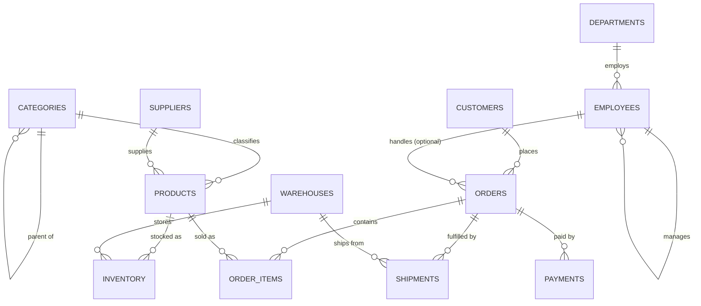

# Entity-Relationship Documentation

Phase 1, Task 1.3. Describes the schema defined in [`schema.sql`](schema.sql).

This document exists for two audiences. A human reads it to understand the
business domain. Later, **Phase 5 schema retrieval** needs the join paths
recorded here to decide which tables a question actually touches — a model that
does not know `order_items` is the bridge between `orders` and `products` will
invent a direct join that does not exist.

---

## Domains

The 12 tables form four loosely-coupled domains. Cross-domain questions are the
hardest tier of the benchmark precisely because they require joining across
these boundaries.

| Domain        | Tables                                                  |
| ------------- | ------------------------------------------------------- |
| Sales         | `customers`, `orders`, `order_items`, `payments`         |
| Catalogue     | `products`, `categories`, `suppliers`                    |
| Logistics     | `shipments`, `warehouses`, `inventory`                   |
| HR            | `employees`, `departments`                               |

---

## Diagram



---

## Join paths

Every foreign key, with the exact join predicate. Copy these directly when
writing benchmark SQL.

| # | From → To | Join predicate | Optional? |
|---|-----------|----------------|-----------|
| 1 | `categories` → `categories` | `c.parent_category_id = p.category_id` | yes |
| 2 | `products` → `categories` | `p.category_id = c.category_id` | no |
| 3 | `products` → `suppliers` | `p.supplier_id = s.supplier_id` | **yes** |
| 4 | `orders` → `customers` | `o.customer_id = c.customer_id` | no |
| 5 | `orders` → `employees` | `o.employee_id = e.employee_id` | **yes** |
| 6 | `order_items` → `orders` | `oi.order_id = o.order_id` | no |
| 7 | `order_items` → `products` | `oi.product_id = p.product_id` | no |
| 8 | `payments` → `orders` | `pay.order_id = o.order_id` | no |
| 9 | `shipments` → `orders` | `sh.order_id = o.order_id` | no |
| 10 | `shipments` → `warehouses` | `sh.warehouse_id = w.warehouse_id` | no |
| 11 | `inventory` → `products` | `i.product_id = p.product_id` | no |
| 12 | `inventory` → `warehouses` | `i.warehouse_id = w.warehouse_id` | no |
| 13 | `employees` → `departments` | `e.department_id = d.department_id` | no |
| 14 | `employees` → `employees` | `e.manager_id = m.employee_id` | **yes** |

**"Optional" means the foreign key column is nullable**, and that is the single
most common source of wrong-but-runnable SQL. An `INNER JOIN` on a nullable FK
silently drops rows. "Total revenue per sales rep" using `INNER JOIN employees`
excludes every online order, and the query still executes and still returns a
plausible-looking number — which is exactly why execution-based evaluation
catches errors that a syntax check never would.

---

## Cardinalities

| Relationship | Cardinality | Note |
|---|---|---|
| customer → orders | 1 : N | a customer may have zero orders |
| order → order_items | 1 : N | every order has at least one line |
| order → payments | 1 : N | deposit + balance means multiple rows |
| order → shipments | 1 : N | split shipments are allowed |
| product → order_items | 1 : N | |
| product × warehouse → inventory | 1 : 1 | enforced by `uq_inventory_product_warehouse` |
| category → products | 1 : N | |
| supplier → products | 1 : N | |
| department → employees | 1 : N | |

---

## Traversals worth knowing

**Customer to product** — there is no direct link. Two joins are required, and
`order_items` is the bridge:

```sql
customers -> orders -> order_items -> products
```

**Product to category hierarchy** — `categories` is self-referencing, so
"everything under Electronics, including sub-categories" needs a recursive CTE,
not a single join:

```sql
WITH RECURSIVE tree AS (
    SELECT category_id FROM categories WHERE category_name = 'Electronics'
    UNION ALL
    SELECT c.category_id
    FROM categories c
    JOIN tree t ON c.parent_category_id = t.category_id
)
SELECT * FROM products WHERE category_id IN (SELECT category_id FROM tree);
```

**Order revenue** — two defensible definitions, and the question is often
ambiguous about which is meant:

```sql
-- From the denormalised column (includes shipping)
SELECT total_amount FROM orders WHERE order_id = 1;

-- Computed from the lines (excludes shipping, applies discounts)
SELECT SUM(quantity * unit_price * (1 - discount_pct / 100))
FROM order_items WHERE order_id = 1;
```

This ambiguity is intentional. Resolving it correctly is a business-rule skill,
and it is one of the things fine-tuning is expected to improve over the
baseline.

---

## Deliberate difficulty features

Design choices made so the benchmark's harder tiers have something real to test.

| Feature | Table | Enables |
|---|---|---|
| Self-referencing hierarchy | `categories.parent_category_id` | recursive CTEs |
| Self-referencing hierarchy | `employees.manager_id` | org-chart traversal |
| Nullable FK | `orders.employee_id` | LEFT vs INNER JOIN correctness |
| Nullable FK | `products.supplier_id` | NULL handling in joins |
| Nullable value | `customers.credit_limit` | `IS NULL`, `COALESCE` |
| Nullable date | `shipments.delivered_date` | in-transit vs delivered |
| Multiple payments per order | `payments` | `HAVING SUM(...)` under-payment |
| Historical vs list price | `order_items.unit_price` | correct revenue source |
| Denormalised total | `orders.total_amount` | ambiguous "revenue" |
| Percentage discount | `order_items.discount_pct` | conditional aggregation |
| Composite grain | `inventory (product, warehouse)` | multi-key grouping |
| `is_active` / `is_discontinued` | several | implicit business filters |

---

## Cascade behaviour

Most foreign keys use the default `NO ACTION` — deleting a referenced row fails,
which is the safe default for a system that executes generated SQL.

Four use `ON DELETE CASCADE`, where the child row has no meaning without its
parent:

- `order_items` → `orders`
- `payments` → `orders`
- `shipments` → `orders`
- `inventory` → `products`

Deleting a customer, product, or employee that has history will **fail** rather
than silently destroying it.
